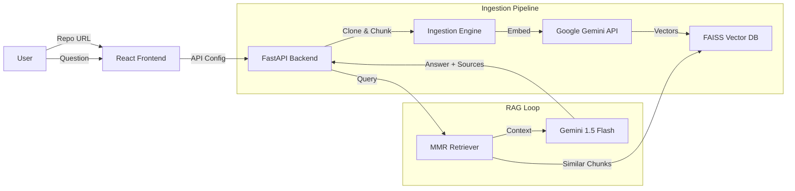

# 🤖 CodeRAG: The Intelligent Repository Assistant

> **Chat with your codebase.** CodeRAG is a semantic search engine that ingests your Git repositories, understands your code structure, and answers complex engineering questions using Google's Gemini 1.5 Flash.


## 🚀 Key Features

-   **🧠 Semantic Understanding**: Uses **Google Gemini Embeddings** to understand the *intent* of your code, not just keywords.
-   **⚡ 1M+ Token Context**: Powered by **Gemini 1.5 Flash**, capable of analyzing massive files and dependency chains in a single pass.
-   **🔍 Source Citations**: Every answer credits the specific file and line numbers used to generate the response.
-   **🕸️ Smart Ingestion**:
    -   Ignores noise (`node_modules`, `lockfiles`).
    -   Respects language syntax (Python, JS, TS) via Tree-sitter chunking.
    -   Fast cloning with `git clone --depth 1`.
-   **💻 Modern Stack**: built with **FastAPI** (Backend) and **React + Tailwind** (Frontend).

---

## 🏗️ Architecture



## 🛠️ Tech Stack

-   **Frontend**: React (Vite), TypeScript, Tailwind CSS, Lucide Icons.
-   **Backend**: Python, FastAPI, Uvicorn.
-   **AI/ML**: LangChain, Google Generative AI (Gemini), FAISS (Vector Store).
-   **Tools**: GitPython, Tree-sitter.

---

## ⚡ Quick Start

### Prerequisites
-   Node.js (v18+)
-   Python (v3.10+)
-   A [Google AI Studio API Key](https://aistudio.google.com/app/apikey)

### 1. Configuration
The `.env` file should already exist in the root directory. If not, copy from `.env.example`:
```bash
cp .env.example .env
```

Edit `.env` and ensure your Google API Key is set:
```bash
# Required
GOOGLE_API_KEY=your_google_api_key_here

# Optional (defaults shown)
SECRET_KEY=supersecretkey_change_me_in_prod
CORS_ORIGINS=http://localhost:5173,http://localhost:3000
CHAT_RATE_LIMIT=50
INGEST_RATE_LIMIT=5
```

### 2. Backend Setup
Install Python dependencies and start the server:
```bash
# Create virtual environment (recommended)
python -m venv venv

# Activate virtual environment
# On Windows:
venv\Scripts\activate
# On Linux/Mac:
source venv/bin/activate

# Install dependencies
pip install -r requirements.txt

# Start the API server
uvicorn api:app --reload --host 0.0.0.0 --port 8000
```
*Server will start at `http://localhost:8000`*
*API documentation available at `http://localhost:8000/docs`*

### 3. Frontend Setup
Open a new terminal, navigate to the frontend folder, and start the UI:
```bash
cd frontend

# Install Node modules
npm install

# Start the dev server
npm run dev
```
*Frontend will start at `http://localhost:5173`*

### 4. First Run
1. Open your browser and navigate to `http://localhost:5173`
2. Create an account (register)
3. Ingest your first repository using the sidebar
4. Start chatting with your codebase!

---

## 🧪 Testing

### Backend Tests
Run the backend test suite with pytest:
```bash
# From the project root
pytest -v
```

### Frontend Tests
Run the frontend test suite with Vitest:
```bash
cd frontend
npm test
```

### Test Coverage
- **Backend**: 39 tests covering auth, repos, sessions, chat, and ingestion
- **Frontend**: 6 tests covering App, FileExplorer, and RepositoryIngestion components

---

## 📖 Usage Guide

1.  **Ingest a Repository**:
    -   Open the sidebar.
    -   Paste a public GitHub URL (e.g., `https://github.com/langchain-ai/langchain`).
    -   Click **Ingest Repository**. This clones the repo and builds the vector index locally.
    
2.  **Ask Questions**:
    -   "How is authentication handled in `auth.py`?"
    -   "Explain the dependency injection pattern used here."
    -   "Where is the main entry point?"

3.  **Inspect Sources**:
    -   Click **View Source Documents** below any AI response to see the raw code chunks retrieved by the engine.

---

## 📂 Project Structure

```
CodeRAG/
├── api.py                 # FastAPI Application entry point
├── ingest.py              # Git cloning & Code chunking logic
├── rag_engine.py          # Vector DB & LLM Chain logic
├── requirements.txt       # Python dependencies
├── .env                   # API Keys (Not committed)
├── vectorstore/           # FAISS index storage (Local DB)
│
└── frontend/              # React Application
    ├── src/
    │   ├── components/    # ChatInterface, Sidebar, etc.
    │   ├── lib/           # API clients
    │   └── App.tsx        # Main layout
    ├── tailwind.config.js # Styling config
    └── vite.config.ts     # Build config
```

## 🤝 Contributing
Pull requests are welcome! For major changes, please open an issue first to discuss what you would like to change.

## 📄 License
[MIT](https://choosealicense.com/licenses/mit/)
